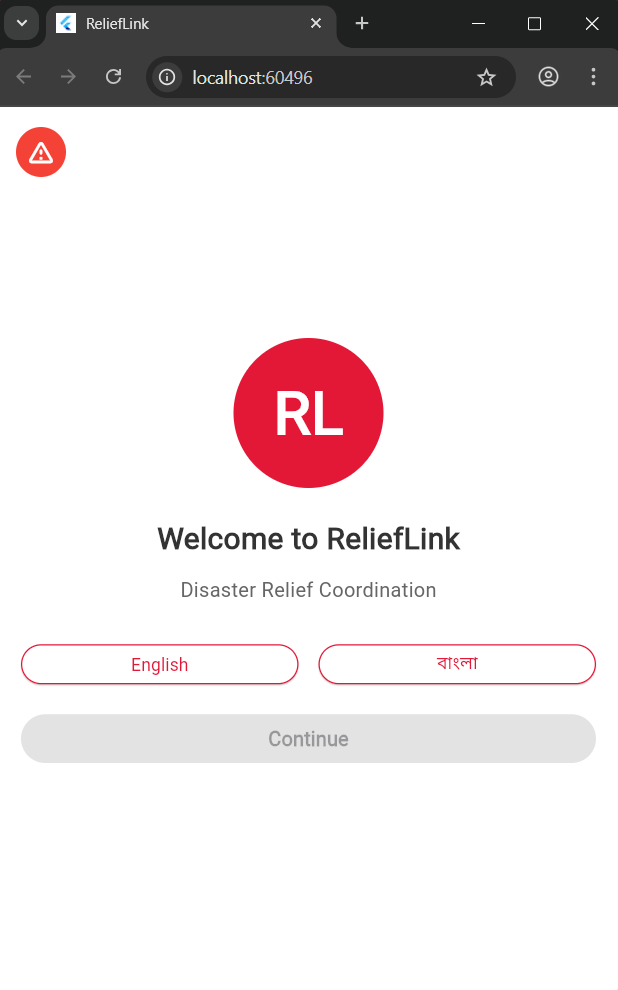
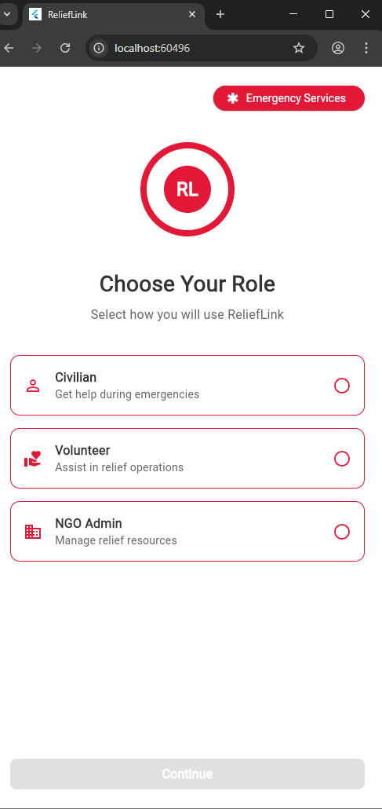
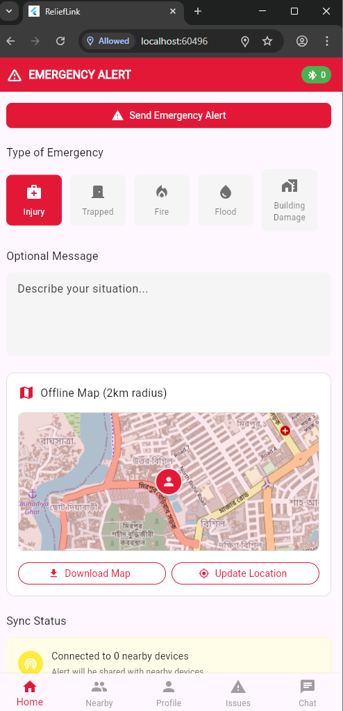
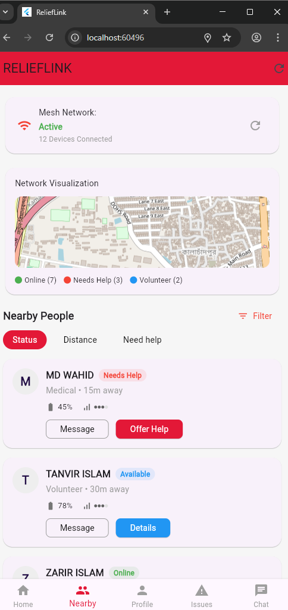
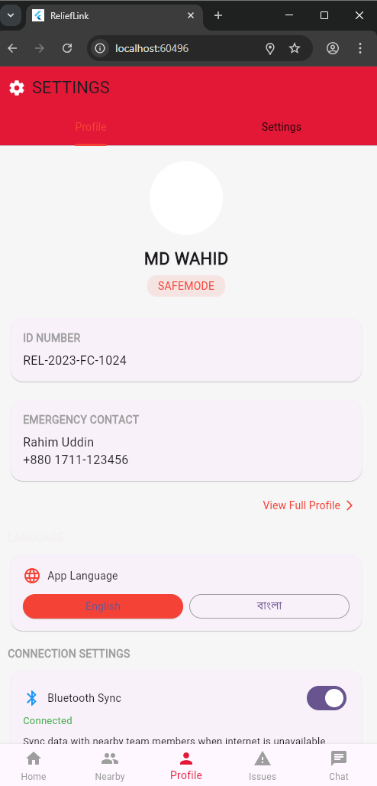
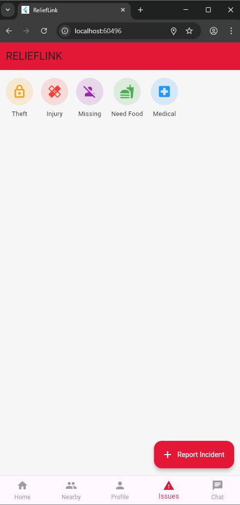
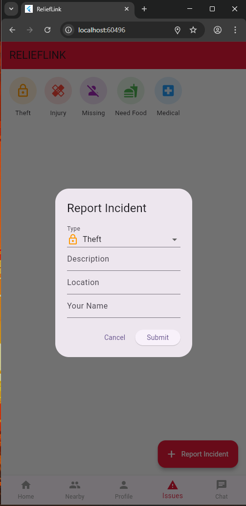

# 🌐 ReliefLink

ReliefLink is an offline-first emergency coordination platform designed to assist during natural disasters. It uses Bluetooth mesh networking, Wi-Fi direct, and SMS synchronization to enable communication and data sharing even in the absence of internet or cellular connectivity.

---

## 🚀 Features

- 📡 Offline mesh communication via Bluetooth
- 🌐 Sync data through Wi-Fi or SMS when online
- 📍 Real-time location sharing and map view
- 📋 Emergency resource tracking and request system
- 🔒 Secure message relaying between nearby users
- 🔄 Automatic sync with central server when reconnected

---

## 📱 Screenshots

| splash Screen                      | Choose role                       | Home Screen with map view UI       |
| ---------------------------------- | --------------------------------- | ---------------------------------- |
|  |  |  |

| Nearby People                      | Profile                           | Issues                             |
| ---------------------------------- | --------------------------------- | ---------------------------------- |
|  |  |  |

| Nearby People                      | Chat with nearby people           |
| ---------------------------------- | --------------------------------- |
|  |  |

> Make sure you place your images in: `assets/screenshots/`

---

## 🎥 Demo Video

🎥 [Watch Demo Video](assets/screeenshot/demo.mp4)

> Replace `YOUR_VIDEO_ID` with the actual YouTube video ID.  
> Or upload the video to GitHub and use a relative path if it’s short.

---

## 🛠️ Tech Stack

- Flutter (Frontend)
- Bluetooth & Wi-Fi Direct (Device-to-device communication)
- Firebase & REST API (Online sync)
- Google Maps API

---

## 📦 How to Run

```bash
git clone https://github.com/wahid1099/ReliefeLink
cd relieflink
flutter pub get
flutter run
```
